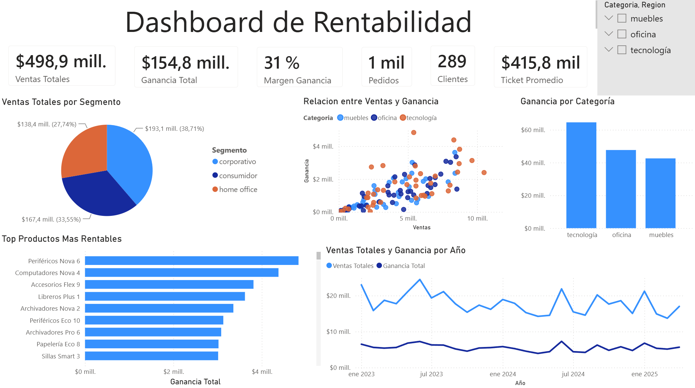

# 📊 Dashboard de Rentabilidad

## 📖 Descripción

Este proyecto tiene como objetivo analizar la rentabilidad de una empresa a partir de sus ventas, productos, clientes y ubicación geográfica.

Para ello se realizó un proceso de limpieza, transformación y análisis de datos utilizando Python, SQLite y Power BI, con el fin de identificar oportunidades de mejora en el negocio.

---

## 🎯 Objetivos

- Analizar las ventas y ganancias de la empresa.
- Calcular el margen de ganancia.
- Identificar las categorías y productos más rentables.
- Comparar el rendimiento por segmento de clientes.
- Visualizar la evolución temporal de las ventas y ganancias.

---

## 🛠️ Tecnologías utilizadas

- Python
- Pandas
- SQLite
- Power BI
- Git
- GitHub

---

## 📂 Archivos del proyecto

| Archivo                               | Descripción                        |
|---------------------------------------|------------------------------------|
| Proyecto_Principal.ipynb              | Limpieza y transformación de datos |
| DataSet_Limpio_SuperTienda.csv        | Dataset limpio                     |
| SuperTienda_BaseDeDatos.db            | Base de datos SQLite               |
| Dashboard-Rentabilidad.pbix           | Dashboard interactivo              |
| Diagrama-Entidad-Relacion(DER).drawio | Modelo entidad-relación            |

---

## 📈 Indicadores (KPIs)

- 💰 Ventas Totales
- 📈 Ganancia Total
- 📊 Margen de Ganancia
- 🛒 Cantidad de Pedidos
- 👥 Clientes
- 🎟️ Ticket Promedio

---

## 📊 Visualizaciones

El dashboard incluye:

- Ventas por segmento.
- Relación entre ventas y ganancia.
- Ganancia por categoría.
- Productos más rentables.
- Evolución mensual de ventas y ganancias.

---

## 🔍 Principales hallazgos

- Tecnología es la categoría con mayor ganancia.
- El segmento corporativo concentra la mayor parte de las ventas.
- Algunos productos generan una rentabilidad considerablemente superior al promedio.
- Las ventas mantienen un comportamiento relativamente estable durante el período analizado.

---

## 🚀 Autor

**Alessandro Escalante**

- Estudiante de Informática (UNGS)
- Data Analytics Bootcamp - Forge & Skillnest
